# Universal Installer Setup

This document explains how to set up the one-liner installation for the Unified Test Framework.

## 🚀 The Goal

Enable developers to install UFT with a simple command:

```bash
curl -sSfL https://install.uft.dev | sh
```

## 📁 Files Created

1. **`install.sh`** - Universal installation script
2. **`docs/index.html`** - Installation landing page
3. **`.github/workflows/release.yml`** - CI/CD pipeline for releases
4. **`serve-installer.py`** - Local testing server

## 🏗️ Installation Script Features

### ✅ **Cross-Platform Support**
- **macOS**: All Intel and Apple Silicon Macs
- **Linux**: x86_64, ARM64, ARMv7 
- **Windows**: x86_64 (via WSL, Git Bash, PowerShell)

### ✅ **Smart Installation Methods**
1. **Prebuilt Binaries** (preferred): Downloads from GitHub Releases
2. **Build from Source** (fallback): Uses Rust/Cargo if binaries unavailable
3. **Language Configs**: Downloads dynamic language configurations
4. **Shell Integration**: Automatically configures PATH in bash/zsh/fish

### ✅ **Robust Error Handling**
- Multi-attempt downloads with retry logic
- Fallback installation methods
- Platform/architecture detection
- Dependency checking (curl/wget, git, tar)

## 🚀 Deployment Options

### Option 1: GitHub Pages (Recommended)

1. **Enable GitHub Pages** in repository settings
2. **Set custom domain** to `install.uft.dev`
3. **Push release tag** to trigger deployment
4. **DNS setup**: Point `install.uft.dev` to GitHub Pages

### Option 2: Custom Domain/CDN

1. **Upload files** to your server/CDN
2. **Serve `install.sh`** at root path (`/`)
3. **Configure SSL/HTTPS** for security
4. **Set proper MIME types** (`text/plain` for shell scripts)

### Option 3: GitHub Raw (Simple)

```bash
# Direct GitHub raw link (works immediately)
curl -sSfL https://raw.githubusercontent.com/your-repo/unified-test-framework/main/install.sh | sh
```

## 🧪 Local Testing

### Test the Installer Script

```bash
# Make executable
chmod +x install.sh

# Test locally (skips download, builds from source)
./install.sh

# Test with force reinstall
UFT_FORCE=1 ./install.sh
```

### Test the Web Interface

```bash
# Start local server
python3 serve-installer.py 8000

# Test installation
curl -sSfL http://localhost:8000 | sh

# View web interface
open http://localhost:8000/docs/index.html
```

## 📋 Release Checklist

Before creating the one-liner installer:

### 1. ✅ **Prepare Repository**
- [ ] Tag a release (e.g., `v1.0.0`)
- [ ] Ensure `install.sh` is in repository root
- [ ] Test installer script locally
- [ ] Verify all language configs are present

### 2. ✅ **Setup CI/CD** 
- [ ] GitHub Actions workflow creates releases
- [ ] Builds binaries for all platforms
- [ ] Uploads binaries to GitHub Releases
- [ ] Deploys installer to GitHub Pages

### 3. ✅ **Configure Domain**
- [ ] Register domain (e.g., `install.uft.dev`)
- [ ] Point DNS to GitHub Pages or your server
- [ ] Enable HTTPS/SSL
- [ ] Test domain resolves correctly

### 4. ✅ **Verify Installation**
- [ ] Test on fresh macOS system
- [ ] Test on fresh Linux system  
- [ ] Test on Windows (WSL/Git Bash)
- [ ] Verify all features work post-install

## 🌍 Installation Flow

```mermaid
graph TD
    A[curl -sSfL install.uft.dev] --> B{UFT installed?}
    B -->|Yes| C[Show already installed]
    B -->|No| D[Detect platform]
    D --> E[Get latest version]
    E --> F{Prebuilt binary available?}
    F -->|Yes| G[Download binary]
    F -->|No| H[Install Rust]
    G --> I[Install language configs]
    H --> J[Build from source]
    J --> I
    I --> K[Configure shell]
    K --> L[✅ Complete!]
```



## 🎯 Usage Examples

### Basic Installation

```bash
# Standard installation
curl -sSfL https://install.uft.dev | sh
```

### Advanced Options

```bash
# Force reinstall
UFT_FORCE=1 curl -sSfL https://install.uft.dev | sh

# Install to custom directory
UFT_INSTALL_DIR=~/bin curl -sSfL https://install.uft.dev | sh

# Install specific version
UFT_VERSION=v1.0.0 curl -sSfL https://install.uft.dev | sh
```

## 📞 Support

After installation, users can:

1. **Test installation**: `uft --help`
2. **View languages**: `uft languages` 
3. **Generate tests**: `uft git-repo https://github.com/user/repo.git`
4. **Get help**: Visit documentation or file issues

---

## 🎉 Ready for Production!

Once deployed, developers can install UFT with the simple one-liner:

```bash
curl -sSfL https://install.uft.dev | sh
```

This provides the same professional experience as rustup, homebrew, and other popular developer tools! 🚀