# Unified Test Framework

A minimal, modular Rust-based framework for automatically generating unit tests across multiple programming languages. Built with simplicity and extensibility in mind.

## 🎯 Overview

The Unified Test Framework automatically analyzes your code to detect testable patterns and generates framework-specific unit tests. It currently supports JavaScript, Python, and Rust with a clean, extensible architecture for adding more languages.

## 🏗️ Architecture

### ASCII Architecture Diagram

```
┌─────────────────────────────────────────────────────────────────────────┐
│                        Unified Test Framework                           │
├─────────────────────────────────────────────────────────────────────────┤
│                                                                         │
│  ┌─────────────────┐    ┌─────────────────────────────────────────┐    │
│  │   CLI Binary    │    │            TestOrchestrator           │    │
│  │                 │    │                                       │    │
│  │ • Generate      │◄───┤ • Language Detection                 │    │
│  │ • Analyze       │    │ • Adapter Registry                   │    │
│  │ • Help          │    │ • Pattern Coordination               │    │
│  └─────────────────┘    └─────────────────┬───────────────────────┘    │
│                                           │                            │
│                         ┌─────────────────┴───────────────────┐        │
│                         │        Language Adapters            │        │
│                         │                                     │        │
│    ┌─────────────────┬──┴──┬─────────────────┬─────────────────┴──┐     │
│    │   JavaScript    │     │     Python      │       Rust         │     │
│    │                 │     │                 │                    │     │
│    │ • Function      │     │ • Function      │ • Function         │     │
│    │   Detection     │     │   Detection     │   Detection        │     │
│    │ • Email Field   │     │ • Email Field   │ • Pattern          │     │
│    │   Validation    │     │   Validation    │   Recognition      │     │
│    │ • Jest Tests    │     │ • Pytest Tests │ • Cargo Tests      │     │
│    └─────────────────┘     └─────────────────┘ └────────────────────┘     │
│                                                                         │
│    ┌─────────────────────────────────────────────────────────────────┐   │
│    │                    Core Data Structures                        │   │
│    │                                                                 │   │
│    │  TestablePattern ──► PatternType ──► TestCase ──► TestSuite     │   │
│    │       │                   │               │           │         │   │
│    │   • ID, Location     • Function      • Input     • Language     │   │
│    │   • Context          • FormField     • Output    • Framework    │   │
│    │   • Confidence       • ApiCall       • Tests     • Imports      │   │
│    └─────────────────────────────────────────────────────────────────┘   │
│                                                                         │
└─────────────────────────────────────────────────────────────────────────┘
```

### Mermaid Architecture Diagram

```mermaid
graph TB
    subgraph "Unified Test Framework"
        CLI[CLI Binary<br/>unified-testing]
        ORCH[TestOrchestrator<br/>Pattern Detection & Coordination]
        
        subgraph "Language Adapters"
            JS[JavaScript Adapter<br/>• Function Detection<br/>• Email Validation<br/>• Jest Test Generation]
            PY[Python Adapter<br/>• Function Detection<br/>• Email Validation<br/>• Pytest Test Generation]
            RS[Rust Adapter<br/>• Function Detection<br/>• Cargo Test Generation]
        end
        
        subgraph "Core Data Flow"
            TP[TestablePattern<br/>• ID & Location<br/>• Pattern Type<br/>• Confidence Score]
            TC[TestCase<br/>• Input/Output<br/>• Test Logic<br/>• Description]
            TS[TestSuite<br/>• Language<br/>• Framework<br/>• Test Collection]
        end
        
        subgraph "Pattern Types"
            FUNC[Function Patterns<br/>• Name & Parameters<br/>• Return Type<br/>• Context]
            FORM[Form Validation<br/>• Email Fields<br/>• Required Fields<br/>• Field Types]
            API[API Patterns<br/>• HTTP Methods<br/>• Endpoints<br/>• Parameters]
        end
    end
    
    subgraph "External Interface"
        FILES[Source Code Files<br/>• .js/.jsx<br/>• .py<br/>• .rs]
        OUTPUT[Generated Tests<br/>• .test.js<br/>• .py<br/>• .rs]
    end
    
    FILES --> CLI
    CLI --> ORCH
    ORCH --> JS
    ORCH --> PY
    ORCH --> RS
    
    JS --> TP
    PY --> TP
    RS --> TP
    
    TP --> FUNC
    TP --> FORM
    TP --> API
    
    TP --> TC
    TC --> TS
    TS --> OUTPUT
    
    style CLI fill:#e1f5fe
    style ORCH fill:#f3e5f5
    style JS fill:#fff3e0
    style PY fill:#e8f5e8
    style RS fill:#fce4ec
```



## 🚀 Features

### Current Implementation (v0.1.0)
- ✅ **Multi-language Support**: JavaScript, Python, Rust
- ✅ **Pattern Detection**: Functions, form validation, basic API patterns
- ✅ **Test Generation**: Framework-specific test code (Jest, Pytest, Cargo)
- ✅ **CLI Interface**: Simple command-line tool
- ✅ **Extensible Architecture**: Easy to add new language adapters
- ✅ **High Test Coverage**: 76.54% code coverage with comprehensive unit tests

### Supported Patterns
- **Function Patterns**: Automatic detection of function signatures and parameters
- **Form Validation**: Email field validation patterns
- **API Endpoints**: Basic HTTP method and path detection (extensible)

### Supported Test Frameworks
- **JavaScript**: Jest (with Mocha, Vitest support planned)
- **Python**: Pytest (with unittest support)
- **Rust**: Cargo test

## 📦 Installation

### From Source
```bash
git clone https://github.com/your-repo/unified-test-framework
cd unified-test-framework
cargo build --release
cargo install --path .
```

### Prerequisites
- Rust 1.70+ (for building)
- Target language runtimes (for running generated tests)

## 🔧 Usage

### Basic Commands

```bash
# Analyze code patterns in a file
cargo run --bin unified-testing -- analyze examples/sample.js

# Generate tests for a file
cargo run --bin unified-testing -- generate examples/sample.py

# Generate tests with custom output directory
cargo run --bin unified-testing -- generate examples/sample.rs --output my-tests/
```

### Example Usage

#### JavaScript Analysis
```bash
$ cargo run --bin unified-testing -- analyze examples/sample.js
Analyzing patterns in: examples/sample.js
Found 3 patterns:
- abc123 (confidence: 0.80)
  Form field: email (type: Email)
- def456 (confidence: 0.90)
  Function: calculateSum with 2 parameters
- ghi789 (confidence: 0.90)
  Function: validateEmail with 1 parameters
```

#### Test Generation
```bash
$ cargo run --bin unified-testing -- generate examples/sample.js
Generating tests for: examples/sample.js
Generated 4 test cases
Tests written to: tests/test_generated_javascript_tests.test.js
```

## 🏗️ Project Structure

```
unified-test-framework/
├── Cargo.toml                 # Project dependencies and metadata
├── README.md                  # This file
├── CLAUDE.md                  # Claude Code guidance
│
├── src/
│   ├── lib.rs                 # Main library exports
│   │
│   ├── core/                  # Core framework components
│   │   └── mod.rs             # TestOrchestrator and data structures
│   │
│   ├── adapters/              # Language-specific adapters
│   │   ├── mod.rs             # Adapter exports
│   │   ├── javascript.rs      # JavaScript/TypeScript support
│   │   ├── python.rs          # Python support
│   │   └── rust.rs            # Rust support
│   │
│   └── bin/
│       └── unified-testing.rs # CLI application
│
├── examples/                  # Sample code files
│   ├── sample.js              # JavaScript examples
│   ├── sample.py              # Python examples
│   └── sample.rs              # Rust examples
│
└── tests/                     # Generated test output
    ├── test_*.test.js         # Generated JavaScript tests
    ├── test_*.py              # Generated Python tests
    └── test_*.rs              # Generated Rust tests
```

## 🔌 Architecture Details

### Core Components

#### TestOrchestrator
Central coordinator that manages language detection and adapter routing:
- Detects file language based on extension
- Routes analysis requests to appropriate adapters
- Coordinates test generation workflow

#### TestGenerator Trait
Common interface implemented by all language adapters:
```rust
#[async_trait]
pub trait TestGenerator {
    async fn analyze_code(&self, source: &str, file_path: &str) -> Result<Vec<TestablePattern>>;
    async fn generate_tests(&self, patterns: Vec<TestablePattern>) -> Result<TestSuite>;
    fn get_language(&self) -> &str;
    fn get_supported_frameworks(&self) -> Vec<&str>;
}
```

#### Core Data Structures
- **TestablePattern**: Represents a detected code pattern with confidence score
- **TestCase**: Individual test with input/output expectations
- **TestSuite**: Collection of tests for a specific language/framework

### Language Adapters

#### JavaScript Adapter
- Uses regex-based parsing for function detection
- Identifies email input fields in HTML/JSX
- Generates Jest-compatible test files
- Supports function parameter analysis

#### Python Adapter  
- Detects function definitions with `def` keyword parsing
- Identifies email-related patterns in Django/Flask contexts
- Generates Pytest-compatible test classes
- Supports method and function analysis

#### Rust Adapter
- Parses function signatures including `pub fn` declarations
- Focuses on function pattern detection
- Generates Cargo test modules
- Supports parameter type analysis

## 🧪 Testing

The framework includes comprehensive unit tests with 76.54% code coverage:

```bash
# Run all tests
cargo test

# Run with coverage (requires cargo-tarpaulin)
cargo install cargo-tarpaulin
cargo tarpaulin --verbose --all-features --workspace --timeout 120
```

### Test Coverage by Module
- **Core Module**: 87.50% (21/24 lines)
- **JavaScript Adapter**: 100% (32/32 lines)  
- **Python Adapter**: 100% (31/31 lines)
- **Rust Adapter**: 100% (15/15 lines)
- **CLI Binary**: 41.67% (25/60 lines)

## 🚦 Development Commands

```bash
# Build the project
cargo build

# Run with specific examples
cargo run --bin unified-testing -- analyze examples/sample.js
cargo run --bin unified-testing -- generate examples/sample.py
cargo run --bin unified-testing -- generate examples/sample.rs

# Development checks
cargo check          # Quick syntax check
cargo clippy         # Linting
cargo fmt            # Code formatting
```

## 🔮 Future Roadmap

### Short Term (v0.2.0)
- [ ] TypeScript-specific pattern detection
- [ ] Enhanced API endpoint analysis
- [ ] More comprehensive form validation patterns
- [ ] Integration test generation

### Medium Term (v0.3.0)
- [ ] Configuration file support
- [ ] Custom pattern definitions
- [ ] More test framework support (Mocha, unittest)
- [ ] Watch mode for continuous test generation

### Long Term (v1.0.0)
- [ ] Additional language support (Go, Java, C#)
- [ ] IDE plugin development
- [ ] Advanced pattern detection with AST parsing
- [ ] Machine learning-enhanced pattern recognition

## 🤝 Contributing

1. Fork the repository
2. Create your feature branch (`git checkout -b feature/amazing-feature`)
3. Add tests for your changes
4. Ensure all tests pass (`cargo test`)
5. Commit your changes (`git commit -m 'Add amazing feature'`)
6. Push to the branch (`git push origin feature/amazing-feature`)
7. Open a Pull Request

### Adding a New Language Adapter

1. Create a new file in `src/adapters/` (e.g., `go.rs`)
2. Implement the `TestGenerator` trait
3. Add pattern detection logic specific to your language
4. Implement test generation for the target framework
5. Register the adapter in the main binary
6. Add comprehensive unit tests

## 📄 License

This project is licensed under the MIT License - see the [LICENSE](LICENSE) file for details.

## 🙏 Acknowledgments

- Built with Rust for performance and safety
- Inspired by the need for consistent testing across multiple languages
- Designed for simplicity and extensibility

## 📊 Metrics

- **Languages Supported**: 3 (JavaScript, Python, Rust)
- **Test Frameworks**: 3+ (Jest, Pytest, Cargo)
- **Pattern Types**: 3 (Functions, Forms, APIs)
- **Code Coverage**: 76.54%
- **Total Tests**: 81 unit tests
- **Performance**: Sub-second analysis for typical files